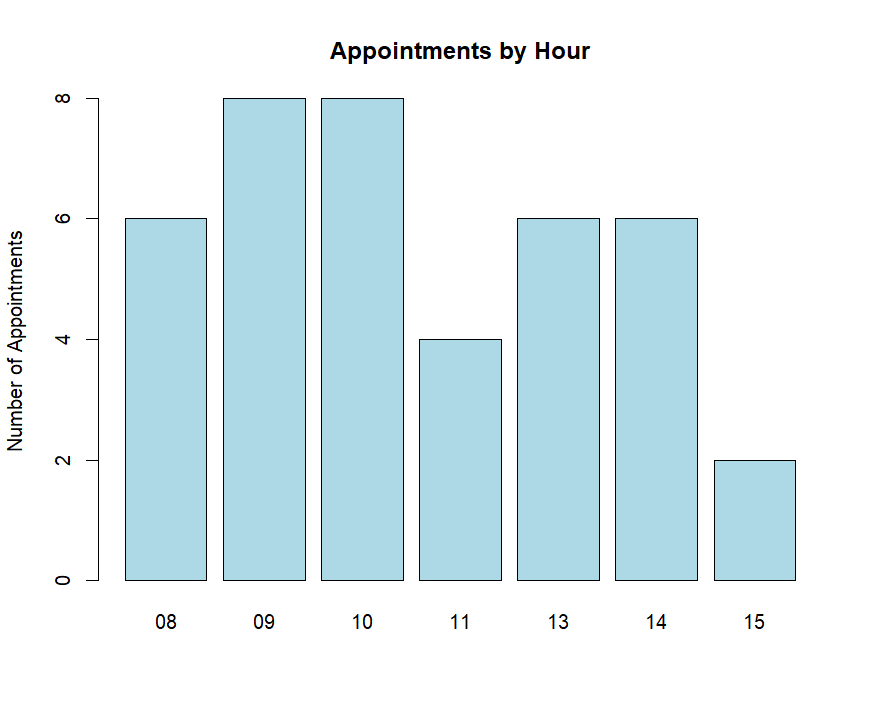
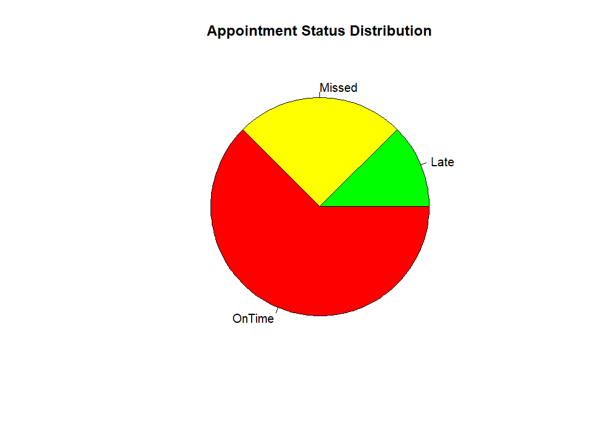

# Healthcare Scheduling System

## Overview
This project analyzes healthcare appointment data to identify missed appointments, late arrivals, and overall attendance patterns.

The system uses a multi-language approach:
- Python for data cleaning and preprocessing  
- Java for structured data representation  
- R for data visualization and reporting  

The goal is to help healthcare clinics better understand scheduling behavior and improve efficiency.

---

## Project Structure

- `health_scheduleing.py` → Python program with menu system  
- `AppointmentRecord.java` → Java class for appointment data  
- `main.R` → R script for generating visualizations  
- `appointments_data.csv` → Raw dataset (input)  
- `cleaned_appointments.csv` → Processed dataset (output)  
- `barchart_appbyhour.png` → Bar chart of appointments by hour  
- `piechart_app_status_distrib.png` → Pie chart of attendance status  
- `README.md` → Project documentation  

---

## Features

### Python (Data Processing and Analysis)
- Reads appointment data from CSV  
- Converts time values into 24-hour format using `datetime`  
- Calculates ArrivalStatus:
  - OnTime → less than or equal to 15 minutes late  
  - Late → more than 15 minutes late  
  - Missed → NoShow = 1  
- Menu-driven interface for:
  - Viewing records  
  - Adding new appointments  
  - Filtering late and missed appointments  
  - Viewing attendance summaries  
  - Sorting patients by missed appointments  
  - Exporting cleaned data  
- Uses bubble sort to rank patients by missed appointments  
- Exports cleaned data to `cleaned_appointments.csv`  

---

### Java (Data Representation)
- Defines `AppointmentRecord` class  
- Stores patient and appointment information  
- Demonstrates object-oriented design for structured data  

---

### R (Visualization)
- Generates charts from cleaned data  
- Bar chart showing appointments by hour  
- Pie chart showing attendance status distribution  
- Outputs PNG files for reporting  

---

## Data Flow
appointments_data.csv → cleaned_appointments.csv → visualization outputs (PNG)

---

## Visualizations

### Appointments by Hour


### Attendance Status Distribution


---

## How to Run

### Python
```bash
python health_scheduleing.py
```
### Java
```bash
javac AppointmentRecord.java
```
### R
```R
source("main.R")
```
## Author
Trent Ta, Riley Wolf, Megan Nguyen, Kaden Tift

